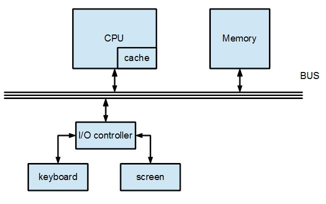

## 快取記憶體 (Cache) 

傳統的處理器通常採用「單一匯流排馮紐曼架構」設計，這種架構非常簡單且易懂，如下圖所示：

但是、以當今的技術，上圖中的記憶體通常採用 DRAM 為主。

這是因為快速的靜態記憶體 (SRAM) 仍然相當昂貴，而速度慢上數十倍的動態記憶體 (DRAM) 則相對便宜，因此電腦的主記憶體通常仍然採用 DRAM 為主。

如果要讓 CPU 的執行速度更快，就不能讓 CPU 遷就於 DRAM 的速度跟著變慢，此時我們可以在 CPU 內部加入一個快取記憶體 (cache)，讓位於 DRAM 中常用到的指令與資料放入快取當中，如下圖所示：

當 CPU 想要執行一個指令時，如果該指令已經在 cache 當中，就不需要讀取 DRAM，因此「指令擷取」階段就可以快上數十倍。

當然、如果該指令需要存取資料，而該資料已經在 cache 當中了，那麼 CPU 就不需要從 DRAM 中讀取資料，因此「資料讀取」階段就可以快上數十倍。

當需要寫入資料時，如果暫時先寫到 cache 當中，而不是直接寫回 DRAM，那麼「資料寫入」的動作就可以快上數十倍。

當然、上述的美好情況不會永遠都成立，假如想存取的指令或資料不存在 cache 當中，那麼就必須從 DRAM 讀取資料，這時 CPU 的速度就會被打回原形，變成與 DRAM 的速度一樣。

而且、當資料被放入 cache 之後，由於 DRAM 當中還有一份同樣的資料，要又如何才能快速的查出資料是否在 cache 當中，就是一個不容易的問題了。這個問題的解決，必須依靠某種「記憶體位址的標籤」 (tag)，透過這種標籤我們可以查出某個位址的內容到底是在 cache 當中的那一格。

而標籤的設計方法，大致可分為「直接映射」 (direct-mapping)，「關連映射」(associate-mapping)與「組關連映射」 (set associative-mapping) 等幾種方法。其中最常採用的是後者。

對這些 cache 作法的細節有興趣的讀者，可以參考下列文件。

* [維基百科：CPU快取](http://zh.wikipedia.org/wiki/CPU%E7%BC%93%E5%AD%98)

